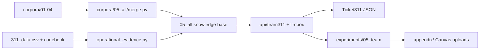

# CMU NL(X) and LLM — Group 3: Pittsburgh 311 Municipal Service Resolution

We are Afaq, Rutomo, Mahika, and Mingchin. Our [team brief](brief/team_corpus_brief.pdf) asks one business question: can an LLM-assisted 311 intake and routing API reduce the time it takes to resolve Pittsburgh service requests? We study the mechanism the brief calls first-time-right intake: classify the request correctly, collect complete details, ask one targeted clarification question, and route it to the right department.

## How we built it

Each of us built one Assignment 1 corpus for one subtopic of the shared WPRDC 311 archive, using the brief's exact category split:

| Lead | Subtopic | Member |
|---|---|---|
| 1 | Streets and Mobility | Afaq |
| 2 | Waste and Neighborhood Cleanliness | Rutomo |
| 3 | Buildings, Construction, and Accessibility | Mahika |
| 4 | Parks, Trees, Animals, and Public Facilities | Mingchin |

For the final project we concatenate the four corpora into one knowledge base (`corpora/05_all`, 854 records). We add one operational evidence file computed for all four subtopics at once from the WPRDC join: volume and median, 75th, and 90th percentile resolution time for 127 issues. The team API retrieves from that knowledge base and turns a resident complaint into a routed 311 ticket.



The ticket has the fields the brief suggests: domain, category, issue, department, missing information, one clarification question, confidence, an abstention flag, and the historical resolution range.

We run the API on Phi-4-mini locally and compare five designs on the same 50 held-out evaluation inputs: prompt only (T0), plus retrieved knowledge (T1), plus codebook tools (T2), plus a guardrail (T3), and a LoRA-finetuned model (T4).

## Layout

| Path | Contents |
|---|---|
| [corpora/](corpora/) | Our four Assignment 1 corpora and the `05_all` merged knowledge base |
| [experiments/](experiments/) | Each member's Assignment 2 work and our `05_team` runs |
| [api/](api/) | Rutomo's LLMBox fork (M0–M5) and our `team311` routing layer |
| [appendix/](appendix/) | Canvas datasets, metrics, and API ZIP, built by `appendix/build_appendix.py` |
| [memo/](memo/) | Our Assignment 1 and Assignment 2 memos |
| [brief/](brief/) | The team brief and the appendix requirements |

## Status

| Member | Assignment 2 package |
|---|---|
| Afaq | Complete |
| Rutomo | Complete |
| Mahika | Complete |
| Mingchin | Complete |

All four Assignment 2 packages are in.

## Commands

```bash
# Merged corpus (854 records)
python3 corpora/05_all/merge.py

# Operational evidence for all four subtopics (needs the gitignored 311_data.csv)
python3 corpora/05_all/operational_evidence.py

# Team intake split (534 DEV / 50 EVAL) and leakage check
python3 experiments/05_team/make_split.py
python3 experiments/05_team/leakage_check.py

# Full team experiment pipeline (Phi-4-mini; about 2 to 3 hours on an M4)
./experiments/05_team/run_all.sh

# Refresh the Canvas appendix
python3 appendix/build_appendix.py
```

Phi weights: [docs/local_phi_model.md](docs/local_phi_model.md) (`../cmu_application_of_nlx_llm/lab01/models/phi-4-mini-instruct`).

Our AI-use disclosure for integrated code: [docs/ai_use/ai_use_index.md](docs/ai_use/ai_use_index.md).

## Evaluation boundary

Following the brief, we report routing quality (issue and department accuracy, completeness, clarification rate, and abstention quality) and historical time-to-close baselines. Historical data cannot show that our API makes requests close faster; that would need a staff-confirmed pilot.
