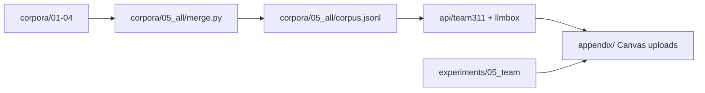

# CMU NL(X) and LLM — Group 3: Pittsburgh 311 Municipal Service Resolution

Business question from the [team brief](brief/team_corpus_brief.pdf): can an LLM-assisted 311 intake and routing API reduce the time required to resolve Pittsburgh service requests?



## Layout

| Path | Contents |
|---|---|
| [corpora/](corpora/) | A1 member corpora + `05_all` merged knowledge base |
| [experiments/](experiments/) | A2 per member + `05_team` unified API runs |
| [api/](api/) | LLMBox fork (Rutomo M0–M5) + `team311` routing layer |
| [appendix/](appendix/) | Canvas datasets, metrics, API ZIP — run `appendix/build_appendix.py` |
| [memo/](memo/) | A1 and A2 memos |
| [brief/](brief/) | Team brief + appendix requirements |

## Commands

```bash
# Merged corpus (854 records)
python3 corpora/05_all/merge.py

# Team intake split (534 DEV / 50 EVAL)
python3 experiments/05_team/make_split.py
python3 experiments/05_team/leakage_check.py

# Full team experiment pipeline (Phi-4-mini; ~2+ hours)
chmod +x experiments/05_team/run_all.sh
./experiments/05_team/run_all.sh

# Refresh Canvas appendix artifacts
python3 appendix/build_appendix.py
```

Phi weights: [docs/local_phi_model.md](docs/local_phi_model.md) (`../cmu_application_of_nlx_llm/lab01/models/phi-4-mini-instruct`).

AI-use disclosure for integrated code: [docs/ai_use/ai_use_index.md](docs/ai_use/ai_use_index.md).
