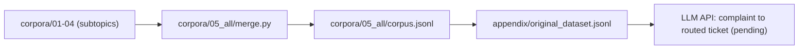

# CMU NL(X) and LLM — Group 3: Pittsburgh 311 Municipal Service Resolution

Business question from the [team brief](brief/team_corpus_brief.pdf): can an LLM-assisted 311 intake and routing API reduce the time required to resolve Pittsburgh service requests? The mechanism is first-time-right intake: correct classification, complete details, one targeted clarification question, and routing to the correct department.

This repo is one continuous project. The four subtopic corpora (Assignment 1) are concatenated into one retrieval knowledge base, and that knowledge base is the original dataset for the LLM API work. Canvas uploads follow [brief/code_appendix_team.txt](brief/code_appendix_team.txt).



## Layout

| Path | Contents |
|---|---|
| [brief/](brief/) | Team corpus brief, split diagram, Canvas appendix requirements |
| [corpora/](corpora/) | `01`–`04`: each member's corpus, labels, and code as submitted. `05_all`: merge code and merged datasets |
| [appendix/](appendix/) | Canvas code appendix: datasets and API code ZIP |
| [memo/](memo/) | Assignment 1 memos |
| [sources/](sources/) | Original submission ZIPs |
| [docs/](docs/) | Local Phi-4-mini setup |

Files for one subtopic share the same name across `corpora/`, `memo/`, and `sources/`:

| Lead | Subtopic | Member | Name | Records |
|---:|---|---|---|---:|
| 1 | Streets and Mobility | Afaq | `01_streets_mobility_afaq` | 190 |
| 2 | Waste and Neighborhood Cleanliness | Rutomo | `02_waste_neighborhood_rutomo` | 180 |
| 3 | Buildings, Construction, and Accessibility | Mahika | `03_buildings_construction_mahika` | 260 |
| 4 | Parks, Trees, Animals, and Public Facilities | Mingchin | `04_parks_public_spaces_mingchin` | 224 |
| – | All four merged | Team | `corpora/05_all` | 854 |

## Build the merged dataset

```bash
python3 corpora/05_all/merge.py
```

The script checks the shared record contract and duplicate IDs, then writes the merged corpus (854 records), human labels (100), sources, taxonomy, and stats into [corpora/05_all/](corpora/05_all/) and refreshes `appendix/original_dataset.jsonl`.

Following the brief's data rule, coordinate and address fields are removed from the merged copy and listed in each record's `metadata.redacted_fields`. Member corpora in `corpora/` are not modified.

## Local Phi model

Weights are not in this repo. They live in the sibling course repo at `../cmu_application_of_nlx_llm/lab01/models/phi-4-mini-instruct`; see [docs/local_phi_model.md](docs/local_phi_model.md).

## Evaluation boundary

From the brief: historical data can test routing quality and establish time-to-close baselines, but it cannot prove the API causes faster resolution. A staff-confirmed pilot is required for causal evidence.
