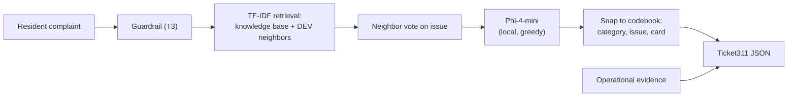

# Pittsburgh 311 intake and routing: baseline facts

We are Afaq, Rutomo, Mahika, and Mingchin (CMU NL(X) and LLM, Group 3). This document is our single source of facts for the final project. Every number here comes from a file in this repository, and each section links to that file. Each section can become one panel of a poster.

**Contents**

1. [Question and answer](#1-question-and-answer)
2. [Key numbers](#2-key-numbers)
3. [Data](#3-data)
4. [What we built](#4-what-we-built)
5. [Evaluation design](#5-evaluation-design)
6. [Results](#6-results)
7. [Safety](#7-safety)
8. [What each of us found first](#8-what-each-of-us-found-first)
9. [What went wrong and what we learned](#9-what-went-wrong-and-what-we-learned)
10. [Limits of these results](#10-limits-of-these-results)
11. [Artifact index](#11-artifact-index)
12. [Poster kit](#12-poster-kit)

---

## 1. Question and answer

**Question.** Can an LLM-assisted 311 intake and routing API reduce the time it takes to resolve Pittsburgh service requests? Our [team brief](../brief/team_corpus_brief.pdf) asks us to study the mechanism it calls first-time-right intake: classify the request correctly, collect complete details, ask one targeted clarification question, and route it to the right department.

**Answer from our data.** A small local model can do first-time-right routing well when it is grounded in the city's own codebook, and it does poorly when it is not.

- **The baseline fails.** Phi-4-mini with a prompt alone routes 0% of complaints to the right category and department.
- **The full design works.** With TF-IDF retrieval, codebook tools, and a neighbor vote, it routes 82% correctly (95% CI 70–92%), and every ticket is schema-valid and carries a clarification question.
- **The finetuned model is halfway there.** A LoRA-finetuned Phi on the same short prompt routes 50% correctly, the fastest of our designs, but it does not reach the grounded design.

Historical data cannot show that requests would close faster. That needs a staff-confirmed pilot (see [section 10](#10-limits-of-these-results)).

## 2. Key numbers

| Fact | Value | Source |
|---|---|---|
| WPRDC 311 requests joined to the codebook | 815,417 | [operational_evidence_summary.json](../corpora/05_all/operational_evidence_summary.json) |
| Requests in our four subtopics | 612,222 | same |
| Issues with historical resolution times | 127 | [operational_evidence.jsonl](../corpora/05_all/operational_evidence.jsonl) |
| Records in our four Assignment 1 corpora | 854 | [corpus.jsonl](../corpora/05_all/corpus.jsonl) |
| Team DEV / EVAL inputs | 534 / 50 | [split_manifest.json](../experiments/05_team/data/split_manifest.json) |
| EVAL items in the knowledge base or DEV | 0 | [leakage_check.py](../experiments/05_team/leakage_check.py) |
| Best routed-correctly accuracy (T2) | 0.82 (CI 0.70–0.92) | [T2 metrics](../experiments/05_team/runs/T2_tools/metrics.json) |
| Prompt-only routed-correctly accuracy (T0) | 0.00 | [T0 metrics](../experiments/05_team/runs/T0_generate/metrics.json) |
| Finetuned routed-correctly accuracy (T4) | 0.50 (CI 0.36–0.64) | [T4 metrics](../experiments/05_team/runs/T4_finetuned/metrics.json) |
| Schema-valid tickets (T2, T3, T4) | 100% | same files |
| Guardrail block rate on member attack probes | 100%, 86%, 42% | [T3 metrics](../experiments/05_team/runs/T3_guarded/metrics.json) |
| Guardrail pass rate on member benign probes | 100%, 94%, 100% | same |

## 3. Data

### Four Assignment 1 corpora, one per subtopic

We split the WPRDC 311 archive by the brief's exact category groups. Each of us built one corpus for one subtopic.

| Subtopic | Member | Records | What is in it |
|---|---|---|---|
| Streets and Mobility | Afaq | 190 | 70 real 2015–2017 requests, 115 resident complaints written from real requests, 5 routing cards |
| Waste and Neighborhood Cleanliness | Rutomo | 180 | City waste guidance and codebook rows and summaries (41% tabular) |
| Buildings, Construction, and Accessibility | Mahika | 260 | WPRDC requests, 65 per category, each with text and structured fields |
| Parks, Trees, Animals, and Public Facilities | Mingchin | 224 | 6 resident-style complaints and 2 resolution-time records for each of 28 issues |

Merged corpus: [corpora/05_all](../corpora/05_all/README.md). Member corpora: [corpora/](../corpora/).

### Operational evidence for all four subtopics

We joined the full WPRDC 311 export to the issue and category codebook on `request_type_id`, following the brief's cleaning contract. For each in-scope issue we computed request volume and the median, 75th, and 90th percentile days to close. Of the 815,417 requests, 142,060 have a request type with no category in the codebook, and 61,135 belong to categories outside our four subtopics.

| Subtopic | Issues | Requests | Busiest issue | Median / p75 / p90 days to close |
|---|---|---|---|---|
| Streets and Mobility | 45 | 244,708 | Potholes (65,666) | 10.1 / 31.9 / 86.8 |
| Waste and Neighborhood | 28 | 225,001 | Weeds/Debris (77,513) | 19.9 / 48.9 / 128.1 |
| Buildings and Construction | 26 | 74,628 | Building Maintenance (28,863) | 28.8 / 97.1 / 383.9 |
| Parks and Public Facilities | 28 | 67,885 | Overgrowth (10,771) | 21.6 / 63.9 / 161.1 |

Resolution time varies widely within a subtopic: Snow/Ice removal closes in a median of 1.1 days, while city tree pruning takes 92.8. These are the historical baselines our tickets report as `historical_resolution_range`. Builder: [operational_evidence.py](../corpora/05_all/operational_evidence.py).

### Knowledge cards

From the operational evidence we built one knowledge card per issue (127 cards). Each card has the codebook issue, category, department, and aliases, plus the issues it is most often confused with (97 cards have at least one). It also has the team-written required details and clarification question for its category. Builder: [knowledge_cards.py](../corpora/05_all/knowledge_cards.py).

## 4. What we built



The API is `route_complaint(text)` in [api/team311](../api/README.md). It is built on Rutomo's LLMBox fork. It returns a `Ticket311` with domain, category, issue, department, missing information, one clarification question, confidence, an abstention flag, and the historical resolution range.

We compare five designs on the same 50 EVAL inputs:

| Run | What the model gets | Post-processing |
|---|---|---|
| T0 | Allowed categories and the complaint | None |
| T1 | T0 plus 3 retrieved knowledge documents | Snap category to the allowed list |
| T2 | 3 labeled DEV neighbors, the neighbor vote's top issue with its required details, and other candidates | Snap category and issue; ground to the issue's codebook card, or fall back to the vote's issue |
| T3 | T2 behind an input and output guardrail | Same as T2, plus output redaction |
| T4 | The T0 prompt, on a LoRA-finetuned Phi | None |

Model: Phi-4-mini-instruct, run locally on an Apple M4 (MPS, bf16), greedy decoding, no repetition penalty, at most 320 new tokens. T4's adapter: LoRA r 8, alpha 16, attention projections, trained on 269 DEV rows for 2 epochs (30 minutes). Details: [docs/local_phi_model.md](local_phi_model.md), [finetune_lora.py](../experiments/05_team/finetune_lora.py).

## 5. Evaluation design

- **Inputs.** The 584 intake items are Afaq's complaints, Mahika's service requests, Mingchin's example texts, and Rutomo's codebook rows, the latter rewritten as "Resident reports: <issue>." We removed sentences that state the answer, such as Mahika's "It was routed to ...".
- **Split.** Seed 952, stratified by member corpus: 534 DEV and 50 EVAL. Of the 50 EVAL inputs, 13 come from Afaq, 12 from Rutomo, 12 from Mahika, and 13 from Mingchin. By gold domain, 14 are parks, 13 streets, 12 waste, and 11 buildings.
- **Gold labels.** Issue, category, and department come from the WPRDC codebook, resolved by request type id or issue name (36 of 50 EVAL items). Where we cannot resolve an item, the member's own label is used (14 items, 8 of them streets). 37 of 584 items have a codebook category outside their member's subtopic, so the API predicts the domain instead of being given it.
- **Leakage.** No EVAL item's id or text appears in the 397-document knowledge index or among the 534 DEV neighbors.
- **Metrics.** Issue, department, routed correctly (category and department both right), domain, and category accuracy, with 1,000-sample bootstrap 95% intervals. Also schema validity against `Ticket311`, completeness, clarification and abstention rates, latency, tokens, and breakdowns by gold domain and input origin. Scorer: [run_team.py](../experiments/05_team/run_team.py).

## 6. Results

### Main table (50 EVAL inputs)

| Run | Issue (CI) | Department (CI) | Routed correctly (CI) | Domain | Schema valid | Clarification | Latency | Prompt tokens |
|---|---|---|---|---|---|---|---|---|
| T0 prompt only | 0.56 (0.42–0.70) | 0.00 (0.00–0.00) | 0.00 (0.00–0.00) | 0.60 | 1.00 | 0.88 | 11.9 s | 292 |
| T1 + retrieved knowledge | 0.56 (0.42–0.70) | 0.70 (0.58–0.84) | 0.38 (0.26–0.52) | 0.68 | 0.98 | 0.94 | 15.2 s | 537 |
| T2 + tools and vote | 0.60 (0.48–0.72) | 0.82 (0.70–0.92) | 0.82 (0.70–0.92) | 0.88 | 1.00 | 1.00 | 15.0 s | 600 |
| T3 T2 + guardrail | 0.60 (0.48–0.72) | 0.82 (0.70–0.92) | 0.82 (0.70–0.92) | 0.88 | 1.00 | 1.00 | 18.5 s | 600 |
| T4 LoRA finetuned | 0.60 (0.46–0.74) | 0.58 (0.44–0.72) | 0.50 (0.36–0.64) | 0.82 | 1.00 | 0.86 | 9.4 s | 292 |

Source: [experiments/05_team/runs/](../experiments/05_team/runs/), copied to [appendix/evaluation_metrics/](../appendix/evaluation_metrics/).

What the table shows:

1. **Department is the field that needs grounding.** T0 gets the issue right 56% of the time but never the department, because it guesses names like "Public Works". Retrieval alone (T1) lifts department to 70%. Copying the department from a codebook card (T2) lifts it to 82%.
2. **Each step adds something we can measure.** Routed correctly goes from 0.00 to 0.38 with retrieval and to 0.82 with tools and the vote. The intervals for T0, T1, and T2 do not overlap.
3. **Finetuning teaches the label vocabulary, not the routing table.** T4 uses the same prompt as T0 and routes 50% correctly against T0's 0%, at the lowest latency. Its misses are mostly plausible but wrong departments, for example "DOMI - Permits" for an Allegheny City Electric streetlight.
4. **The guardrail costs nothing in accuracy.** T3 matches T2 on EVAL, which has no attacks, and adds 3.5 seconds per request.

### Routed correctly by gold domain

| Gold domain | n | T0 | T1 | T2 | T4 |
|---|---|---|---|---|---|
| Parks | 14 | 0.00 | 0.50 | 0.86 | 0.86 |
| Buildings | 11 | 0.00 | 0.36 | 0.82 | 0.73 |
| Waste | 12 | 0.00 | 0.33 | 1.00 | 0.25 |
| Streets | 13 | 0.00 | 0.31 | 0.62 | 0.15 |

### Routed correctly by input type

| Input type | n | Who wrote it | T2 | T4 |
|---|---|---|---|---|
| Free-text resident complaint | 13 | Afaq | 0.62 | 0.15 |
| Service request or example text | 25 | Mahika, Mingchin | 0.84 | 0.80 |
| Codebook row ("Resident reports: <issue>.") | 12 | Rutomo | 1.00 | 0.25 |

Free-text complaints are the closest to real 311 intake and the hardest case: T2 routes 62% of them correctly. Codebook rows name the issue, so T2's 100% on them is an easy case. T4 misses most of them because waste had only 29 DEV rows to train on.

## 7. Safety

The T3 guardrail screens the input for injection, toxic content, and requests for the system prompt, and screens the output for leaks. We tested it on the Part D probe sets from three members' Assignment 2 work.

| Probe set | Probes | Attacks blocked | Benign requests passed |
|---|---|---|---|
| Mahika (buildings) | 28 | 100% | 100% |
| Rutomo (waste) | 30 | 86% | 94% |
| Mingchin (parks) | 22 | 42% | 100% |

The guard is a keyword and pattern filter. It blocks the attack wording it knows, and it misses politely worded out-of-scope requests and attacks phrased in new ways, which most of Mingchin's probes are. Every member saw the same pattern in Assignment 2. Without a guard, instructions planted inside a record worked for every member who tested them, so we treat the corpus itself as untrusted input.

## 8. What each of us found first

The team design comes straight from our individual work. Full summaries: [memo/member_summaries.md](../memo/member_summaries.md).

| Member | Assignment 1 finding | Assignment 2 best result | What the team design took |
|---|---|---|---|
| Afaq | Phi's real category accuracy was 68% under a JSON format failure; adding routing rules took department from 0% to 40%, beating Claude Sonnet without rules (4%) | Structured output with routing rules: 84% category, 38% department | Free-text complaints, the hardest EVAL inputs |
| Rutomo | Phi matched all three tags on 36%; GPT-5.6 Luna on 88% | Guarded structured output: 66% exact (CI 52–78%), every output valid | LLMBox fork, guardrail, seeded runs |
| Mahika | Phi never predicted permits or accessibility; a format-only fix did not help | Four category definitions: category 0.74 to 0.96, accessibility 0.00 to 0.92 | Category guidance in the knowledge cards |
| Mingchin | Giving Phi the official mapping took fully correct records from 0 to 15 of 25 | TF-IDF top-3 majority vote plus LLM: 80% full record, 98% department | The neighbor vote at the core of T2, and resolution-time records |

Across all four of us: Phi understands the complaint but not Pittsburgh's labels; giving it the city's label space helps more than anything else; and a schema fixes the format, not the answer.

## 9. What went wrong and what we learned

| What happened | Effect | Fix |
|---|---|---|
| We used a repetition penalty of 1.15 to stop runaway output | It penalized prompt tokens the ticket must copy. T4 returned an empty category and issue for every item, and T0 issue accuracy fell to 16% | No repetition penalty. T0 issue rose to 56% and T2 routed correctly from 76% to 82% |
| The first finetune used 149 rows, 1 epoch, and targets with no clarification question | T4 routed 0% correctly and never asked a question | 269 rows, 2 epochs, card-based clarification targets: 50% routed, 86% clarified |
| Hugging Face `Trainer` stalled before its first step on MPS | Several training attempts produced nothing | A plain PyTorch loop with the same settings |
| LoRA training needs about 11 GB of GPU memory on a 24 GB laptop | Out of memory with browsers and other apps open | Close other apps before training |
| Some member inputs stated the answer | Inflated accuracy | Removed routing and status sentences; rewrote codebook rows as resident reports |
| The appendix ZIP picked up an ignored `.env` file with a token | Would have published a secret in a public repo | The ZIP now packages only git-tracked files; nothing was ever pushed |

## 10. Limits of these results

- **50 EVAL inputs.** Each accuracy can move about 13 points either way, so only large gaps (T0 vs T2, T2 vs T4) are clearly beyond noise.
- **Only 13 inputs are real-style free text.** The other 37 are service-request summaries, example texts, or codebook rows, and some of them name the issue. Accuracy on real resident wording is closer to T2's 62% on Afaq's complaints than to the 82% overall.
- **Gold labels.** 14 of 50 EVAL labels are member labels rather than codebook labels, 8 of them streets.
- **Historical times are not outcomes.** Days to close record when a request changed status, not when the problem was fixed, and they cannot show that our API would make requests close faster. That would need a staff-confirmed pilot.
- **The guardrail is a keyword filter.** It is easy to evade with new wording.
- **One model on one machine.** All runs are Phi-4-mini on an M4 with greedy decoding.

## 11. Artifact index

| Artifact | Path |
|---|---|
| Team brief and appendix requirements | [brief/](../brief/) |
| Member corpora (Assignment 1) | [corpora/01–04](../corpora/) |
| Merged corpus, operational evidence, knowledge cards | [corpora/05_all/](../corpora/05_all/README.md) |
| Member Assignment 2 work | [experiments/01–04](../experiments/README.md) |
| Team split, runs, finetune, chat logs | [experiments/05_team/](../experiments/05_team/README.md) |
| Team API | [api/team311/](../api/README.md) |
| Ticket schema (`Ticket311`) | [ticket311.py](../api/llmbox/src/pydantic_models/ticket311.py) |
| Per-run metrics | [experiments/05_team/runs/](../experiments/05_team/runs/) |
| LoRA training log | [finetune/train_metrics.json](../experiments/05_team/finetune/train_metrics.json) |
| Canvas appendix (datasets, metrics, chat logs, API ZIP) | [appendix/](../appendix/README.md) |
| Member memos and summaries | [memo/](../memo/README.md) |
| Phi setup and decoding notes | [docs/local_phi_model.md](local_phi_model.md) |
| AI-use disclosure | [docs/ai_use/ai_use_index.md](ai_use/ai_use_index.md) |

To reproduce: [README commands](../README.md#commands).

## 12. Poster kit

### Suggested panels

1. **Problem.** Misrouted 311 requests wait in the wrong queue. The City's own guide estimates that residents misclassify 5–10% of web requests.
2. **Data.** Four corpora, 854 records; 815,417 historical requests; 127 issues with resolution times ([section 3](#3-data)).
3. **System.** The pipeline diagram in [section 4](#4-what-we-built).
4. **Main result.** Bar chart of routed correctly, T0 to T4, with intervals.
5. **Where it works and where it does not.** Grouped bars by gold domain or input type.
6. **Safety.** Guardrail block and pass rates by probe set.
7. **Lessons.** Three rows from [section 9](#9-what-went-wrong-and-what-we-learned): the repetition penalty, the finetune targets, and grounding departments.
8. **Limits and next step.** A staff-confirmed pilot on real complaints.

### Chart data

Main result (routed correctly with 95% CI):

```csv
run,label,routed_correctly,ci_low,ci_high,issue,department,latency_s
T0,Prompt only,0.00,0.00,0.00,0.56,0.00,11.9
T1,+ Retrieval,0.38,0.26,0.52,0.56,0.70,15.2
T2,+ Tools and vote,0.82,0.70,0.92,0.60,0.82,15.0
T3,+ Guardrail,0.82,0.70,0.92,0.60,0.82,18.5
T4,LoRA finetuned,0.50,0.36,0.64,0.60,0.58,9.4
```

Routed correctly by gold domain:

```csv
domain,n,T0,T1,T2,T4
Parks,14,0.00,0.50,0.86,0.86
Buildings,11,0.00,0.36,0.82,0.73
Waste,12,0.00,0.33,1.00,0.25
Streets,13,0.00,0.31,0.62,0.15
```

Guardrail:

```csv
probe_set,probes,attack_block_rate,benign_pass_rate
Mahika (buildings),28,1.00,1.00
Rutomo (waste),30,0.86,0.94
Mingchin (parks),22,0.42,1.00
```

Historical resolution time, busiest issue per subtopic:

```csv
subtopic,issue,requests,median_days,p75_days,p90_days
Streets,Potholes,65666,10.1,31.9,86.8
Waste,Weeds/Debris,77513,19.9,48.9,128.1
Buildings,Building Maintenance,28863,28.8,97.1,383.9
Parks,Overgrowth,10771,21.6,63.9,161.1
```

### One-line takeaway

A 4-billion-parameter local model routes 82% of 311 complaints correctly when we ground it in Pittsburgh's own codebook, and 0% when we do not.
